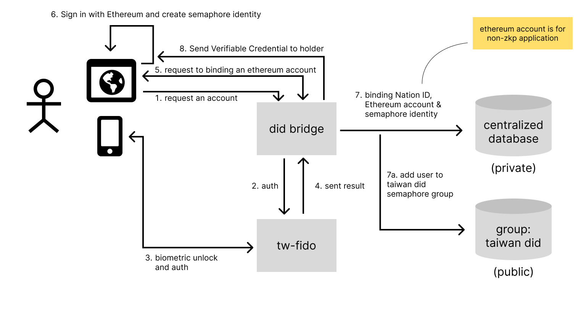

Firstly, we establish a did bridge server responsible for the authentication processes of TW FidO and Sign-in With Ethereum.

Before starting the following procedure, it's checked whether the user has a wallet software like MetaMask.

1. After a user enters the did bridge website, they request to create an account, at which point they need to provide their National ID number.
2. Did bridge sends an authentication request to tw-fido, which supports two forms of authentication.
   1. Push notification: Directly via TW FidO app push notification, the user can carry out user authentication after clicking the notification.
   2. QR Code: tw-did bridge website generates a QR code, the user logs in by scanning it with TW FidO app.
3. Users unlock the key pair stored in their device through biometric devices like fingerprints or facial recognition, and perform signature verification.
4. tw-did obtains user verification results from tw-fido through the API `SP-API-ATH-02`.
5. Did bridge uses Sign-In with Ethereum to request the user to log in with their Ethereum account.
6. The user signs via their Ethereum private key and generates a semaphore identity.
7. After obtaining the user's information, did bridge records two things:
   1. In a private database, it records the newly generated uuid, National ID number, Ethereum account, and semaphore commitment information.
   2. In the semaphore group, the user's provided commitment is added to the Taiwan DID Group.

After these steps, the user will get three things: a **DID** and a **DID Document** that can be obtained after DID resolution, and two **Verifiable Credentials**.

After logging in, you will obtain two Verifiable Credentials. The first one is issued by the DID Bridge and binds a Taiwanese resident identity to an Ethereum address. The second one is a Semaphore proof encapsulated as a Verifiable Credential.

The example of the first Ethereum address binding to a Taiwanese resident identity is as follows. Note that there will be no ID number here. The ID number information is recorded in the private database of tw-did, but it is not recorded in the certificate below:

```json
{
  "@context": [
    "https://www.w3.org/2018/credentials/v1",
    "A Context for binding national id subject"
  ],
  "type": ["VerifiableCredential", "AlumniCredential"],
  "issuer": "did:ethr:0x1234", // issuer ethereum account
  "issuanceDate": "2010-01-01T19:23:24Z",
  "id": "https://did-bridge.tw/credential/49920e44-36f8-4aa8-a7e8-bf069067f576",
  "credentialSubject": {
    "id": "did:ethr:0x5678"
  },
  "credentialStatus": {
    "type": "TBD",
    "id": "https://did-bridge.tw/status/49920e44-36f8-4aa8-a7e8-bf069067f576"
  },
  // proof signed by issuer
  "proof": {
    "type": "EthereumEip712Signature2021",
    "created": "2017-06-18T21:19:10Z",
    "proofPurpose": "assertionMethod",
    "verificationMethod": "did:ethr:0x1234#controller",
    "proofValue": "..."
    "eip712": {...}
  }
}
```

This is a certificate binding a Taiwanese resident's identity to an Ethereum address, and it is signed by the issuer. This certificate will be directly handed over to the holder for preservation. Moreover, this credential can also be reviewed when logged in.

This credential has a `credentialStatus` property, which can be used to ensure whether the credential is revoked at a specific location. This method points the DID to the `did:ethr` DID, maintains decentralization while implementing a centralized revocation list. There's also a reserved possibility for decentralization, the revocation list could be changed to the blockchain equivalent.

Another Verifiable Credential will be the Semaphore group's proof, issued and signed by the issuer, but anyone who knows the secret can issue this information. Here's an example:

```json
{
  "@context": [
    "https://www.w3.org/2018/credentials/v1",
    "<an context for semaphore verifiable credential>"
  ],
  "type": ["VerifiableCredential", "SemaphoreGroupCredential"],
  "issuer": "0x0", // should be an anonymous issuer or random key
  "credentialSubject": {
    "merkleTreeRoot": "1806...3000",
    "signal": "3274...1104",
    "externalNullifier": "3819...3136"
  },
  "proof": {
    "type": "Semaphore",
    "proof": [
      "7704...4876",
      "2094...0736",
      "1322...3462",
      "1224...2426",
      "2157...1921",
      "4422...8692",
      "8693...1464",
      "1575...5755"
    ]
  }
}
```
