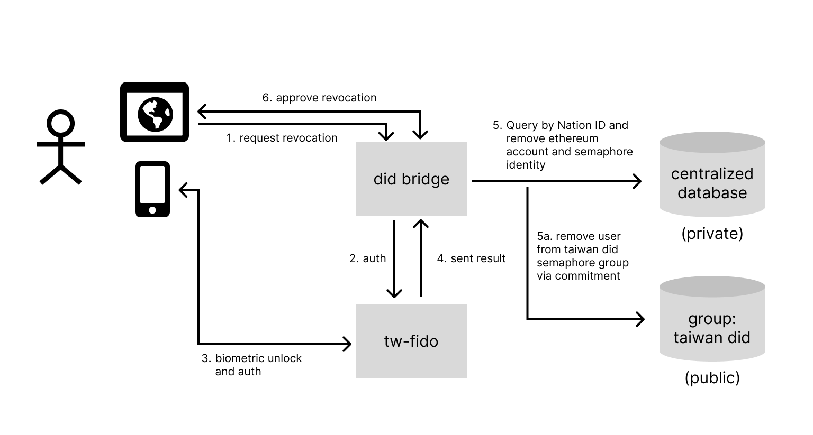

The tw-did service can revoke the registration of a blockchain account and a semaphore commitment through user verification with TW FidO, as shown in the figure below:



When a user wants to revoke their blockchain address, the process is as follows:

1. The user submits a revocation request
2. tw-did requests TW FidO to authenticate the user
3. The user authenticates through a biometric device in TW FidO app
4. The authentication information is returned
5. tw-did actually revokes the information in the database:
   1. Find the ethereum address and semaphore identity with the ID number and delete them
   2. Remove the user's semaphore identity from the Taiwan DID group
6. Accept the revocation

The figure above does not involve the update of the revocation list. In reality, the revocation list will also be updated, and the verifier can learn about the current status of a credential from the revocation list. Here, an example from Revocation List 2020 is quoted, and a Verifiable Credential with credentialStatus is as follows:

```json
{
  "@context": [
    "https://www.w3.org/2018/credentials/v1",
    "https://w3id.org/vc-revocation-list-2020/v1"
  ],
  "id": "https://example.com/credentials/23894672394",
  "type": ["VerifiableCredential"],
  "issuer": "did:example:12345",
  "issued": "2020-04-05T14:27:42Z",
  "credentialStatus": {
    "id": "https://dmv.example.gov/credentials/status/3#94567",
    "type": "RevocationList2020Status",
    "revocationListIndex": "94567",
    "revocationListCredential": "https://example.com/credentials/status/3"
  },
  "credentialSubject": {
    "id": "did:example:6789",
    "type": "Person"
  },
  "proof": { ... }
}
```

During verification, a verifier will need to go to the URL mentioned in `revocationListCredential` and the index mentioned in `revocationListIndex` to find the correct status.

And a revocation list will look something like this:

```json
{
  "@context": [
    "https://www.w3.org/2018/credentials/v1",
    "https://w3id.org/vc-revocation-list-2020/v1"
  ],
  "id": "https://example.com/credentials/status/3",
  "type": ["VerifiableCredential", "RevocationList2020Credential"],
  "issuer": "did:example:12345",
  "issued": "2020-04-05T14:27:40Z",
  "credentialSubject": {
    "id": "https://example.com/status/3#list",
    "type": "RevocationList2020",
    "encodedList": "H4sIAAAAAAAAA-3BMQEAAADCoPVPbQsvoAAAAAAAAAAAAAAAAP4GcwM92tQwAAA"
  },
  "proof": { ... }
}
```
