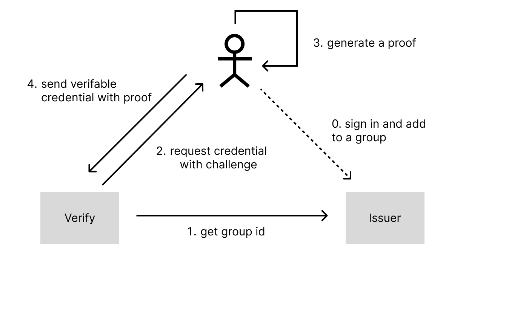

The verification of tw-did is divided into two methods. The first is through the verification of a Verifiable Credential with an Ethereum address, and the other is through the verification via Semaphore Group proof. The former will disclose the user's Ethereum address, while the latter does not need to reveal any information.

## Ethereum address

When users register, they will obtain a verifiable credential with Ethereum address. The subject of the credential will be a `did:ethr` DID, and it would look something like this:

```json
{
  "@context": [
    "https://www.w3.org/2018/credentials/v1",
    "A Context for binding nation id subject"
  ],
  "type": ["VerifiableCredential", "AlumniCredential"],
  "issuer": "did:ethr:0x1234", // issuer Ethereum account
  "issuanceDate": "2010-01-01T19:23:24Z",
  "id": "https://did-bridge.tw/credential/49920e44-36f8-4aa8-a7e8-bf069067f576",
  "credentialSubject": {
    "id": "did:ethr:0x5678" // holder's DID
  },
  "credentialStatus": {
    "type": "TBD",
    "id": "https://did-bridge.tw/status/49920e44-36f8-4aa8-a7e8-bf069067f576"
  },
  // proof signed by issuer
  "proof": {
    "type": "EthereumEip712Signature2021",
    "created": "2017-06-18T21:19:10Z",
    "proofPurpose": "assertionMethod",
    "verificationMethod": "did:ethr:0x1234#controller",
    "proofValue": "...",
    "eip712": {...}
  }
}
```

Users can directly present this Verifiable Credential (VC), and the verifier can verify it in two steps:

1. Verify whether the issuer's signature in the `proof` is correct.
2. Check the information in `credentialStatus` to confirm whether the certificate has been revoked.

Once confirmed, verification can be performed. If there is a need to further verify whether the holder is the subject of the credential, it can be done through Verifiable Presentation (VP) to get an additional signature from the holder, which involves verifying the following three pieces of information:

1. Verify the holder's signature as indicated in the `proof` in the VP.
2. Verify the issuer's signature in the VC inside the VP.
3. Check the `credentialStatus` field to confirm whether the certificate has been revoked.

## Semaphore proof

In addition to direct verification through the Verifiable Credential obtained during registration, since the Semaphore commitment provided by the user after registering with tw-did is also added to the Taiwan DID Semaphore group, it is also possible to prove one's identity through Semaphore. The advantage of this is that it can be verified without disclosing one's Ethereum address or other related information.



First, the verifier would have obtained information about the Taiwan DID Semaphore group from the issuer. They can access this using an address. For example, if the Taiwan DID group id is 1234, they might be able to get information from the following location:

- https://did-bridge.tw/group/1234

The following information will be obtained here:

- All commitments
- Group id, which is 1234
- Tree depth
- merkleTreeRoot

When the user makes a verification request, the verifier will give them a random integer challenge. The user will also need to download various tree data and generate a new Verifiable Credential with their Semaphore identity. It may look like this:

```json
{
  "@context": [
    "https://www.w3.org/2018/credentials/v1",
    "<an context for semaphore verifiable credential>"
  ],
  "type": ["VerifiableCredential", "SemaphoreGroupCredential"],
  "issuer": "0x0", // should be an anonymous issuer
  "credentialSubject": {
    "merkleTreeRoot": "1806...3000",
    "signal": "3274...1104",
    "externalNullifier": "3819...3136"
  },
  "proof": {
    "type": "Semaphore",
    "proof": [
      "7704...4876",
      "2094...0736",
      "1322...3462",
      "1224...2426",
      "2157...1921",
      "4422...8692",
      "8693...1464",
      "1575...5755"
    ]
  }
}
```

With this information, the verifier can directly verify locally whether the user is in this group. This method of verification has several characteristics:

- Group information and commitments are public, and anyone can download them.
- Except for the tw-did bridge, no one knows what the correspondence between the commitment and the ID number is.
- The verifier doesn't know the user's commitment, only that the user can prove that they are truly in this group.
- The tw-did bridge doesn't know which user generated the proof, only that someone downloaded the group information.
- The issuer of this Verifiable Credential can be anonymous, and there's no need for the issuer's signature check.

### Revocation of the Semaphore Verification Method

Since this Verifiable Credential is generated in real-time, it does not use a revocation list to confirm identity. Instead, once tw-did removes a commitment from the semaphore group, it can no longer generate proofs based on the latest information. This design approach preserves flexibility for the future transition to a more decentralized revocation method.
