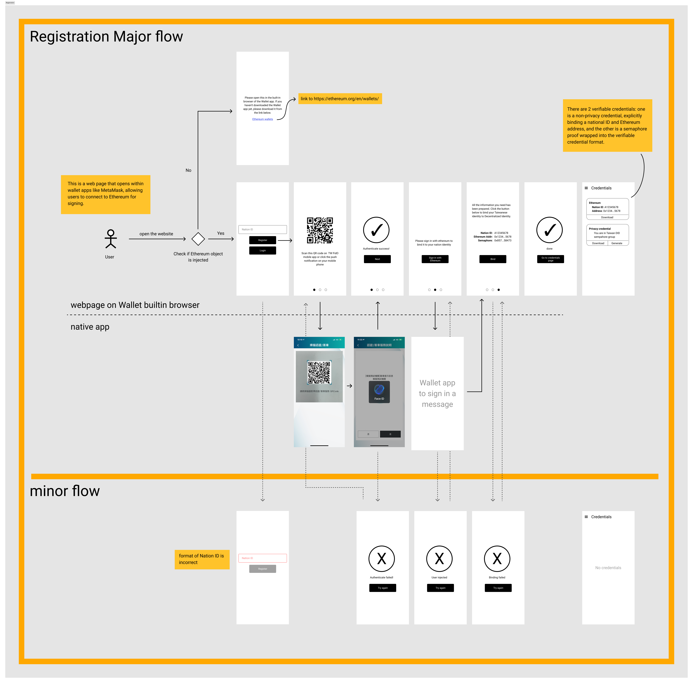
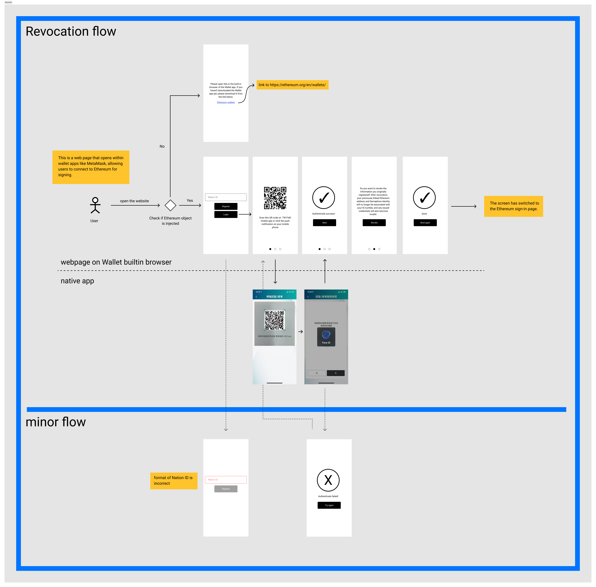
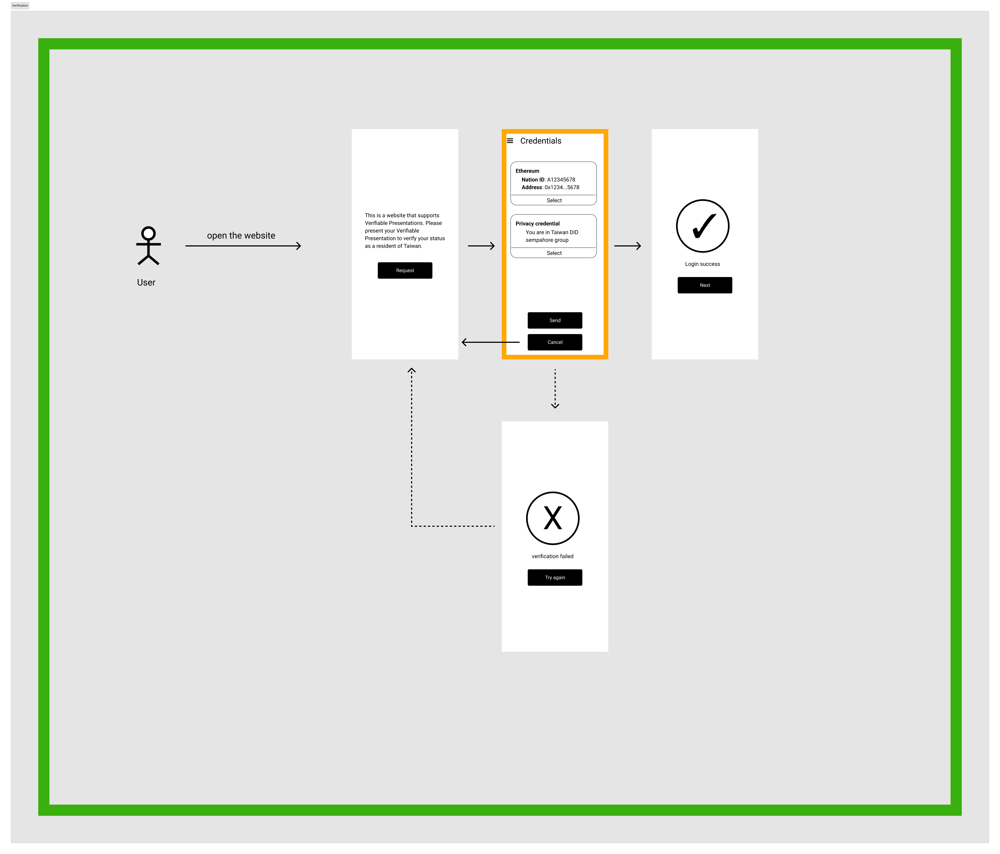

# Wireframes

The tw-did project will be a bridging service with a web interface. The wireframes below are presented in the format of a mobile web page, but the site will also support desktop web formats. The user interface planning is divided into three parts: binding, revocation, and verification. Please refer to the latest wireframes on [Figma](https://www.figma.com/file/LrQAov4Nvg3GkpSHJlUiaN/tw-bridge-wireframing?type=design&node-id=753269-448&mode=design&t=jWlu4PncWxSqu4uJ-0) for more details.

## Binding

When a user connects to the site, it first checks whether a wallet app is installed. If not, it will guide the user to the wallet app's introduction page. Next, users need to input their identification number to verify their Taiwanese residency through the TW FidO service.

After confirming, a QR Code will be generated, and a push notification will be sent to the user's phone. The user can then scan the QR code via the TW FidO app or click on the push notification on their phone for verification. Once the verification is complete, users will be asked to sign a message for Ethereum address verification.

Finally, by clicking "bind", the user's Taiwanese residency will be linked to both an Ethereum address and a Semaphore Identity. These two different types of credentials can be viewed on the Credentials page.

## Revocation

When a user decides to revoke the link between their Taiwanese residency and their DID, they can proceed through the revocation process. The revocation process is similar to the binding process, but it does not require Ethereum identity verification. After revocation, the issued certificates can still pass signature verification, but the verifier can check the revocation list to know whether the certificate status is revoked.

## Verification

When a third-party service, as a verifier, wants to confirm if a user is a Taiwanese resident, it can request the user's credential information from the tw-did website. After the user selects the credentials they wish to use, the verifier can verify whether the credentials are correct.

It's important to note that the credentials are requested from tw-did, but they could be stored in a wallet app that supports Verifiable Credentials. The verification process does not require the issuer's participation. This design was adopted primarily because of the uncertain level of support for Verifiable Credential wallet apps, so the approach of requesting from tw-did was chosen for now.
